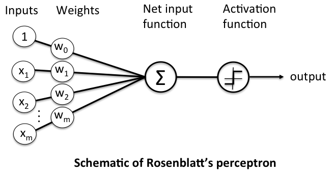
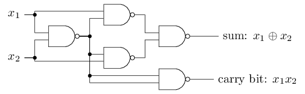

# Perceptron netwerk

(c) 2025 Hogeschool Utrecht  
Auteur: Tijmen Muller (tijmen.muller@hu.nl)

- Studentnummer:
- Naam:
- Datum:

In deze opdracht gaan we een netwerk van perceptrons programmeren. Doe dit zonder gebruik te maken van frameworks, zoals TensorFlow en PyTorch. 

## Perceptron unit

We beginnen met een object-georiënteerde implementatie van een enkele perceptron.

1. Schrijf een klasse `Perceptron`:
    
    - Een perceptron heeft in ieder geval _weights_ en een _bias_. Let op: er geldt dat _bias_ = _–treshold_.

    - Voeg de activatiefunctie toe om uitvoer (_output_) te leveren bij een gegeven invoer (_input_).
    
    - Voeg ook een methode `__str__()` toe om een Perceptron-object op een leesbare manier af te drukken.

2. Test je enkele perceptron.

    - Initialiseer een `Perceptron` voor elk van de INVERT-, AND- en OR-poorten en test of ze op de juiste manier werken.

    - Initialiseer een `Perceptron` voor een NOR-poort met drie ingangen en test of deze op de juiste manier werkt.

    - Initialiseer ook een `Perceptron` voor een uitgebreider beslissysteem (minimaal 3 inputs) en test of deze naar verwachting werkt.

## Perceptron netwerk

Een _layered feed-forward network_ van perceptrons bestaat uit één of meer lagen van perceptrons. (In de praktijk gaat het meestal om twee of meer lagen.) Elke perceptron uit een laag is verbonden met alle perceptrons uit een volgende laag.

3. Schrijf een klasse `PerceptronLayer`. Een laag heeft één of meer `Perceptron`s en levert bij activatie dus eenzelfde aantal outputs. Schrijf ook een `__str__()` methode.

4. Schrijf een klasse `PerceptronNetwork`. Een netwerk heeft één of meer `PerceptronLayers`. Schrijf een methode die de uitvoer van het netwerk bepaalt bij een gegeven input door middel van feed forward. Voeg ook een `__str__()` methode toe.

5. Test je netwerk van perceptrons.
    
    - Initialiseer een `PerceptronNetwork` voor de XOR-poort met twee ingangen en test of deze op de juiste manier werkt.
    
    - Initialiseer een `PerceptronNetwork` voor de _half adder_ (zie onder) en test of deze op de juiste manier werkt.

## Perceptron learning rule

Zoals je inmiddels weet, is een perceptron een *linear classifier*, het kan dus elk lineair classificatieprobleem oplossen. Om tot een oplossing te komen, kun je gebruik maken van de [*perceptron learning rule*](plr.md). Deze werkt als volgt: gegeven target $d$, input $\vec{x}$, weights $\vec{w}$ en bias $b$:

- output $y = g \left( w \cdot \vec{x} \right)$ met activatiefunctie $g$ en met $y \in  \{ 0, 1 \}$
- error $e = d - y$
- verandering $\Delta \vec{w} = \eta \cdot e \cdot \vec{x}$ met $\eta$ een constante *learning rate* (kies bijvoorbeeld $\eta = 0.1$)
- verandering $\Delta b = \eta \cdot e$
- nieuwe $\vec{w}' = \vec{w} + \Delta \vec{w}$
- nieuwe $b' = b + \Delta b$

Ga zelf na dat bovenstaande overeenkomt met [deze formule](https://sebastianraschka.com/Articles/2015_singlelayer_neurons.html#the-perceptron-learning-rule):

$$\Delta w_j = \eta \cdot (\textrm{target}^{(i)} - \textrm{output}^{(i)}) \cdot x_j^{(i)}$$

De perceptron leert door deze *learning rule* herhaaldelijk uit te voeren voor een verzameling trainingsvoorbeelden tot het geconvergeerd is. De perceptron is geconvergeerd als het alle trainingsvoorbeelden goed voorspelt. Het is mogelijk om de *mean squared error* (MSE) te berekenen om dit vast te stellen. De MSE voor $n$ trainingsvoorbeelden is gegeven door:

$$MSE = \frac{1}{n}\sum_{i=1}^{n}{(d_i – y_i)^2}$$

NB. Het is niet erg gebruikelijk om de MSE toe te passen bij de perceptron learning rule, maar we zullen de MSE later opnieuw gebruiken, dus voor ons practicum is het wel eenduidig om deze functie te gebruiken.

Implementeer het leeralgoritme voor de perceptron:

6. Schrijf een `update()` methode die bovenstaande learning rule implementeert.

7. Schrijf een `loss()` methode die de totale *loss* (MSE) over alle trainingsvoorbeelden berekent.

8. Test het leeralgoritme van je perceptron.

    - Train de perceptron tot het de AND-functie heeft geleerd. Initialiseer een perceptron met willekeurige startwaarden. Wat zijn de uiteindelijke parameters van de perceptron?
    - Train de perceptron tot het de XOR-functie heeft geleerd. Initialiseer een perceptron met willekeurige startwaarden. Wat zijn de uiteindelijke parameters van de perceptron?
    - Train de perceptron om de [Iris-dataset](https://scikit-learn.org/stable/auto_examples/datasets/plot_iris_dataset.html) te classificeren. Je kunt de Iris-dataset eenvoudig importeren met de import `from sklearn.datasets import load_iris`.  
        Initialiseer een perceptron met willekeurige startwaarden, waarbij je je studentnummer gebruikt als [random seed](https://docs.python.org/3/library/random.html#random.seed).

        - Classificeer de types *Setosa* en *Versicolour* (het type *Verginica* moet je dus uit de dataset filteren). Wat zijn de uiteindelijke parameters van de perceptron?

        - Classificeer nu de types *Versicolour* en *Verginica*. Wat zijn de uiteindelijke parameters van de perceptron?

## Vectorisatie van perceptron netwerk

Herschrijf je implementatie van `PerceptronNetwork` naar een variant die gebruik maakt van matrices (praktisch: `numpy` arrays) in plaats van attributen, zoals in de object-georiënteerde variant hierboven. Een instantie van deze klasse bevat nu een lijst van matrices die de lagen van je netwerk representeren. 

Elke rij in deze matrix is nu een perceptron in die laag. Elke kolom vertegenwoordigt een verbinding met een perceptron uit de vorige laag: in de eerste kolom de _bias_, in de tweede kolom de _weight_ met de eerste perceptron uit de vorige laag, in de derde kolom de tweede perceptron uit de vorige laag, enzovoorts. Het perceptron netwerk voor de XOR kan er dan bijvoorbeeld zo uit zien:

* Hidden layer:

$$\begin{bmatrix}
    -1  &    1  &   1  \\
     1  &   -1  &  -1  \\
\end{bmatrix}$$

* Output layer:

$$\begin{bmatrix}
    -2  &    1  &   1  \\
\end{bmatrix}$$

De klassen `Perceptron` en `PerceptronLayer` verdwijnen nu dus uit de implementatie, want die informatie zit nu opgeslagen in matrices. 

9. Herschrijf de methoden voor het initialiseren en activeren van een perceptron netwerk, zodat ze op een (efficiënte) manier gebruik maken van Numpy arrays.

10. Test je gevectoriseerde perceptron netwerk met eerdergenoemde logische poorten: de AND (2 inputs, 1 laag), de NOR (3 inputs, 1 laag), de XOR (2 inputs, 2 lagen) en de half adder (2 inputs, 2 lagen)).
