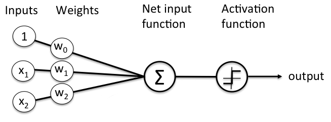

# Perceptron learning rule

(c) 2025 Hogeschool Utrecht  
Auteurs: Tijmen Muller

## Inleiding

We hebben de output van de netwerken uit de vorige lessen berekend met behulp van *feed forward*. De weights en biases waren hierbij gegeven, maar het hele idee van machine learning is natuurlijk om de computer te laten *leren* wat die parameters van het netwerk zouden moeten zijn. We gaan daarom naar een algoritme kijken waarmee de weights en biases van een perceptron geleerd kunnen worden aan de hand van een trainingset met inputs en gewenste outputs. Dat algoritme heet de *perceptron learning rule*.

## Trainen

De weights en biases van een netwerk worden bepaald door te trainen: voor elementen uit een trainingset geeft het netwerk een voorspelde output en er wordt bekeken of die output correct is. Als de output niet correct is, wordt het netwerk aangepast. In algemene zin werkt het trainen van een neuraal netwerk als volgt:

- Initialiseer een netwerk met willekeurige waardes voor de weights en biases;
- Doe zolang je (teveel) foutieve outputs krijgt:
    - geef het netwerk een input en vergelijk de voorspelde output van het netwerk met de verwachte output;
    - als de outputs **niet** overeen komen:
        - bestraf de weights en biases in het netwerk die verantwoordelijk waren voor de foutieve output door ze aan te passen

Je gaat dus stap-voor-stap het netwerk updaten totdat je uitkomt bij een verzameling van parameters waarmee het netwerk de gewenste output geeft.

## Perceptron learning rule

> **Let op:** je zult merken dat in verschillende bronnen (boeken, video's, blogposts) de notatie kan afwijken van de onze. Naast de notatie zijn er mogelijk ook verschillen in ontwerp: hieronder wordt bijvoorbeeld de *bias* gemodelleerd als weight $w_0$ met een constante input $x_0 = 1$. Ook de step function werkt hieronder anders: deze geeft -1 of 1 als output in plaats van de 0 of 1 in de reader. Dit soort verschillen zul je tegen blijven komen, dus wees daar alert op!

De perceptron learning rule wordt in de reader niet uitgelegd. We gebruiken daarom de uitleg uit de [blog](https://sebastianraschka.com/Articles/2015_singlelayer_neurons.html) van Sebastian Raschka. Deze uitleg wordt hieronder nader toegelicht. De eerste paragrafen van het blog zijn een herhaling, vanaf de paragraaf '[The Perceptron Learning Rule](https://sebastianraschka.com/Articles/2015_singlelayer_neurons.html#the-perceptron-learning-rule)' wordt het interessant.

In het blog wordt de perceptron learning rule uitgelegd met een notatie die we eerst moeten snappen. In de figuur uit het blog hierboven zie je de inputs $x_1, x_2, ..., x_m$ en weights $w_0, w_1, w_2, ..., w_m$, waarbij $w_0$ de bias $b$ voorstelt. Daarnaast wordt ook deze uitspraak gedaan: "For each training sample $X^{(i)}$". Het is belangrijk om de volgende notaties te snappen:

- Een dataset bestaat meestal uit meerdere items (datapunten, observaties, of *training examples*). Je zou kunnen verwachten dat item $i$ genoteerd zou worden als $x_i$, maar omdat we het *subscript* al gebruiken voor de verschillende inputsignalen, wordt het $i$-de item genoteerd als $x^{(i)}$.

- Elk item uit de dataset bestaat vaak uit meerdere *inputs* (ook wel kenmerken of *attributen* genaamd, bijvoorbeeld in het geval van de welbekende Iris-dataset). In dit geval zijn het $m+1$ inputs. Bij een AND-poort is de input bijvoorbeeld (0, 1). In dit geval is $x = (0, 1)$ met $x_1 = 0$ en $x_2 = 1$.

- Dat betekent dat $x_j^{(i)}$ staat voor input $j$ van element $i$.

- Een netwerk bestaat vaak uit meerdere gewichten, in dit geval zijn dat ook $m+1$ gewichten: $w_0$ (voor de bias) tot en met $w_m$.

Met name deze formule is belangrijk om te snappen:

$$ \Delta w_j = \eta \; (target^{(i)} - output^{(i)}) \; x_j^{(i)} $$

De formule wordt hieronder ontleed:

- Het idee is dat je voor elke gewicht $w_j$ op zoek gaat naar een kleine aanpassing, $\Delta w_j$, waarmee je dat gewicht kunt aanpassen;
- Hoe klein of hoe groot die aanpassing is, bepaal je zelf met behulp van de *learning rate* die wordt genoteerd als $\eta$. Dit is doorgaans een waarde tussen 0.0 en 1.0. Voor de learning rate geldt:
    - Hoe groter de learning rate, hoe groter de stappen zijn die gezet worden in het aanpassen van het netwerk. Dit _kan_ leiden tot een snellere route naar het beste netwerk, maar het kan er ook voor zorgen dat je 'te snel' leert en daardoor *over* een optimale oplossing *heen kunt schieten*.

    - Kleine stapjes leiden vaker naar een optimale oplossing, maar het kan dan wel heel lang duren...

- Die aanpassing wil je uiteraard baseren op hoe goed de voorspelling was, daarom kijk je voor elk element $x^{(i)}$ uit de dataset naar het verschil van de gewenste output $target^{(i)}$ en de daadwerkelijke output van het netwerk $output^{(i)}$. Dit verschil noemen we de *error*. Het idee is als volgt:

    - Als de target en output hetzelfde zijn, is $error = target^{(i)} - output^{(i)} = 0$. Er volgt dan geen aanpassing, want de voorspelling was goed.

    - Als de target en output verschillen zijn, wordt dat verschil gebruikt om de weights te updaten. Merk op dat de *error* bij een perceptron altijd -1 of 1 is!
- Je vermenigvuldigt de learning rate $\eta$ met de error en de input. Samen is dat de delta, dus de aanpassing van het netwerk!

## Voorbeeld

In de figuur hierboven staat een perceptron met twee inputs, waarmee een AND-poort gemodelleerd kan worden. We initialiseren de perceptron met willekeurige waarden, in dit geval:

- bias $b = w_0 = -1.5$
- $w_1 = -0.5$
- $w_2 = 0.5$

Er wordt (uiteraard) gebruik gemaakt van de step function, waarvoor geldt dat wanneer de som van de inputs met de weights groter of gelijk aan 0 is, het resultaat 1 is en anders is het resultaat 0. Voor het trainen van het model gebruiken we een learning rate $\eta = 0.8$. De gebruikte trainingset is natuurlijk de waarheidstabel van de AND (om praktische redenen draaien we de tabel even om):

| input $x_1$ | input $x_2$ | target $d$ |
|:-----------:|:-----------:|:----------:|
|     $1$     |     $1$     |     $1$    |
|     $1$     |     $0$     |     $0$    |
|     $0$     |     $1$     |     $0$    |
|     $0$     |     $0$     |     $0$    |

### Iteratie 1

Het eerste element uit de dataset is $x_1 = x_2 = 1$ met gewenste output $d = 1$. Na de *feed forward* blijkt de *net input* van de perceptron als volgt te zijn:  
$(1 \times -1.5) + (1 \times -0.5) + (1 \times 0.5) = -1.5$.  
Na toepassing van de step function is de output $a = 0$ en dat is niet correct, want $1 \land 1$ moet $1$ geven.

We kunnen voor alle gewichten $w_j$ nu de delta $\Delta w_j$ berekenen:

- $\Delta w_0 = 0.8 \times (1 - 0) \times 1 = 0.8$ en dus $w'_0 = w_0 + \Delta w_0 = -1.5 + 0.8 = -0.7$
- $\Delta w_1 = 0.8 \times (1 - 0) \times 1 = 0.8$ en dus $w'_1 = w_1 + \Delta w_1 = -0.5 + 0.8 = 0.3$
- $\Delta w_2 = 0.8 \times (1 - 0) \times 1 = 0.8$ en dus $w'_2 = w_2 + \Delta w_2 = 0.5 + 0.8 = 1.3$

### Iteratie 2

Het tweede element uit de dataset is (1, 0) met een verwachte output van $d = 0$. De *net input* van het netwerk met de aangepaste weights uit iteratie 1 is als volgt: $(1 \times -0.7) + (1 \times 0.3) + (0 \times 1.3) = -0.4$.

Na toepassing van de step function blijkt het resultaat $a = 0$; dat is wél correct. In deze iteratie worden de gewichten niet aangepast, want voor de formule zijn alle delta's gelijk aan 0.

### Iteratie 3 en verder

Hierna ga je verder met de derde iteratie met element 3 uit de dataset, daarna met element 4, daarna weer met element 1, et cetera. Je gaat hiermee door totdat het netwerk perfect werkt en er geen updates meer plaatsvinden.
